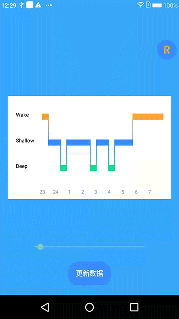

[](https://github.com/yinhaide/Rocket-master/wiki)
[](https://github.com/yinhaide/Rocket-master/wiki)
[](https://www.apache.org/licenses/LICENSE-2.0)

# HDSemicircle
一个非常轻量级别的睡眠质量分布控件，支持自定义属性



## 特性
+ **支持动画过度**

+ **支持设置各个睡眠质量的颜色**

+ **支持连接各个睡眠质量条**

## 如何快速集成

### 导入方式
在工程级别的**build.gradle**添加
```
allprojects {
    repositories {
        ...
        maven { url 'https://jitpack.io' }
    }
}
```
在应用级别的**build.gradle**添加
```
api 'com.github.yinhaide:HDSleepQuality:0.0.1'
```

## 范例
```
[XML]
    <com.yhd.semicircle.SemiCircleView
        android:background="@color/colorWhite"
        android:id="@+id/smc"
        android:layout_marginStart="16dp"
        android:layout_marginEnd="16dp"
        android:layout_centerInParent="true"
        android:layout_width="match_parent"
        android:layout_height="wrap_content"
        app:se_deepColor="#ffa239"/>

[JAVA] 
    /**
     * 需要加深分布点,是一个String[]类表,规则如下
     * String[0]:开始百分比(0-1f)
     * String[1]:扫过的百分比(0-1f)
     * String[0] + String[1] <= 1f
     */
    List<float[]> deepArray = new ArrayList<>();
    deepArray.add(new float[]{0.2f, 0.1f});
    deepArray.add(new float[]{0.4f, 0.1f});
    deepArray.add(new float[]{0.6f, 0.1f});
    barChartView.setDeepArray(deepArray);
```

## 分享设计思路
> 控件整体由三种睡眠质量的长度条以及他们的连线组成
+ 第一步：绘制三种睡眠质量的长条
+ 第二步：依次线条连接各个在睡眠长条

## 这个项目会持续更新中... 
> 都看到这里了，如果觉得写的可以或者对你有帮助的话，顺手给个星星点下Star~

这个控件内部采用一个Fragment框架，如果有兴趣的话可以去了解一下
+ [https://github.com/yinhaide/Rocket-master](https://github.com/yinhaide/Rocket-master)

## 关于我
+ **Email:** [123302687@qq.com](123302687@qq.com)
+ **Github:** [https://github.com/yinhaide](https://github.com/yinhaide)
+ **简书:** [https://www.jianshu.com/u/33c3dd2ceaa3](https://www.jianshu.com/u/33c3dd2ceaa3)
+ **CSDN:** [https://blog.csdn.net/yinhaide](https://blog.csdn.net/yinhaide)

## LICENSE
````
Copyright 2019 haide.yin(123302687@qq.com)

Licensed under the Apache License, Version 2.0 (the "License");
you may not use this file except in compliance with the License.
You may obtain a copy of the License at

    http://www.apache.org/licenses/LICENSE-2.0

Unless required by applicable law or agreed to in writing, software
distributed under the License is distributed on an "AS IS" BASIS,
WITHOUT WARRANTIES OR CONDITIONS OF ANY KIND, either express or implied.
See the License for the specific language governing permissions and
limitations under the License.
````